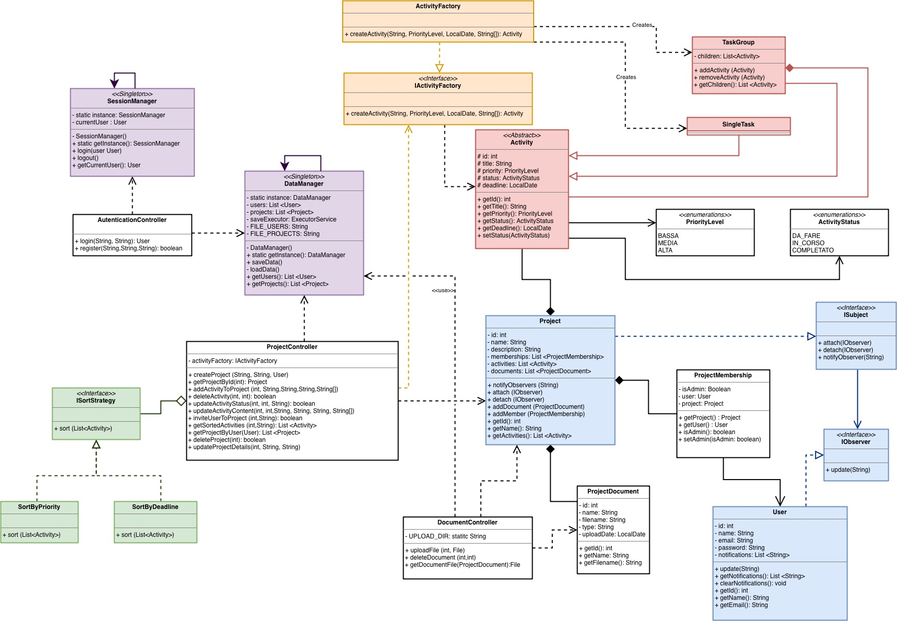

# 🚀 SynergyFX - Project Management System

SynergyFX è un'applicazione desktop sviluppata in **JavaFX** per la gestione avanzata di progetti, attività e documenti aziendali. 

Il progetto è stato realizzato applicando rigorosamente i principi dell'**Ingegneria del Software** e i principi **SOLID**, con un forte focus sull'architettura Object-Oriented (Pattern MVC) e sull'uso dei **Design Pattern (GoF)** per garantire codice pulito, modulare e manutenibile.

---

## ✨ Funzionalità Principali

* **Gestione Utenti:** Autenticazione (Login/Registrazione) e gestione della sessione.
* **Gestione Progetti:** Creazione di progetti e assegnazione dei membri del team.
* **Organizzazione Attività (Gerarchica):** Creazione di Task singoli o Gruppi di Task (attività contenenti sotto-attività).
* **Condivisione Documenti:** Upload e download di file associati a specifici progetti.
* **Notifiche in tempo reale:** Sistema di notifica interno per aggiornare gli utenti sulle nuove attività o documenti assegnati.
* **Ordinamento Dinamico:** Ordinamento delle attività per Priorità o per Data di Scadenza.
* **Salvataggio Dati:** Persistenza dei dati in locale tramite serializzazione asincrona per non bloccare l'interfaccia grafica.

---

## 🏗️ Architettura e Design Pattern

Il codice è strutturato seguendo il pattern architetturale **Model-View-Controller (MVC)**. 
Per risolvere specifiche problematiche di design, sono stati implementati i seguenti **5 Design Pattern (GoF)**:

1. 🟢 **Composite Pattern (Structural):** Utilizzato per gestire la gerarchia delle attività. La classe astratta `Activity` fa da base sia per i `SingleTask` (foglie) che per i `TaskGroup` (nodi composti), permettendo al sistema di trattarli in modo uniforme.
2. 🟠 **Factory Method (Creational):** L'interfaccia `IActivityFactory` e la sua implementazione nascondono al controller la logica complessa di istanziazione delle attività, decidendo dinamicamente se creare un Task singolo o un gruppo.
3. 🔵 **Observer Pattern (Behavioral):** Implementato tra i `Project` (Subject) e gli `User` (Observer). Quando un progetto subisce una modifica (es. un nuovo documento o task), tutti i membri del progetto vengono notificati automaticamente.
4. 🔴 **Strategy Pattern (Behavioral):** Utilizzato per incapsulare gli algoritmi di ordinamento (`SortByPriority`, `SortByDeadline`) dietro l'interfaccia `ISortStrategy`, permettendo al Controller di variare il criterio di ordinamento a runtime.
5. 🟣 **Singleton Pattern (Creational):** Garantisce un unico punto di accesso globale per la gestione dello stato dell'utente (`SessionManager`) e per l'I/O asincrono su file (`DataManager`).

---

## 🛠️ Tecnologie Utilizzate

* **Linguaggio:** Java 17
* **GUI Framework:** JavaFX 17 (con file `.fxml` e CSS)
* **Build Tool:** Maven
* **Librerie Esterne:** Google Guava

---

## 🚀 Installazione ed Esecuzione

Il progetto utilizza il `maven-assembly-plugin` per generare un file eseguibile indipendente (Fat JAR) contenente tutte le dipendenze native.

### Prerequisiti
* **Java JDK 17** o superiore.
* **Maven** installato (oppure utilizzare il wrapper `mvnw` se presente).
